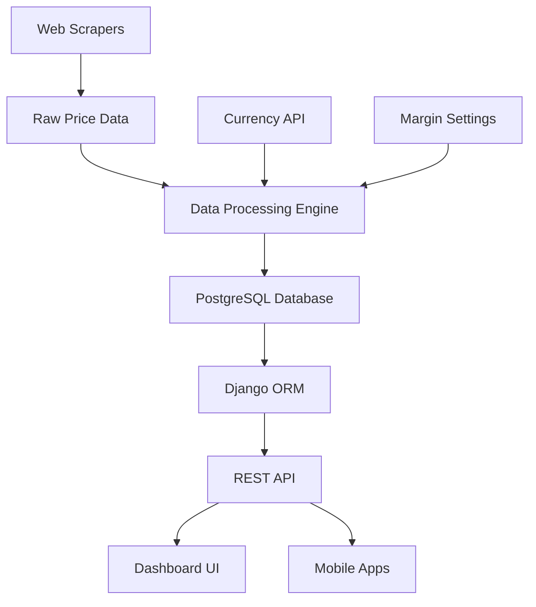

# MF Benchmarker 🚀

**Originally built in 2022** - Currently reviving this repository to showcase as a live demo for my online portfolio.

> A sophisticated **Cigar Price Benchmarking and Inventory Management System** built with Django REST Framework. This enterprise-grade application demonstrates advanced full-stack development skills including web scraping, data analytics, real-time pricing, and comprehensive API design.

[](https://www.python.org/)
[](https://www.djangoproject.com/)
[](https://www.django-rest-framework.org/)
[](https://www.postgresql.org/)
[](LICENSE)

## 🎯 Project Overview

**MF Benchmarker** is a comprehensive business intelligence platform designed for cigar retailers to:

- **Automated Price Monitoring**: Real-time competitor price scraping from multiple sources
- **Dynamic Pricing Analytics**: Intelligent margin calculations with currency conversion
- **Inventory Intelligence**: Advanced stock analysis and "never sold" product identification  
- **Export & Reporting**: Professional Excel reports with conditional formatting
- **REST API**: Complete RESTful API with OpenAPI documentation
- **Real-time Dashboard**: Interactive analytics dashboard with chart visualizations

### 🏢 Business Problem Solved

Cigar retailers needed a way to:
1. Monitor competitor prices across multiple websites automatically
2. Calculate optimal pricing based on dynamic margins and exchange rates
3. Identify underperforming inventory (products that never sell)
4. Generate professional reports for business analysis
5. Manage complex supplier relationships and pricing strategies

## 🛠️ Technical Architecture

### **Backend Stack**
- **Django 4.2** - Web framework with ORM
- **Django REST Framework** - RESTful API development
- **PostgreSQL/MySQL** - Production database with SSH tunneling support
- **Redis** - Caching and session management
- **Pandas** - Advanced data analysis and manipulation
- **AsyncIO/aiohttp** - High-performance web scraping
- **Celery** - Distributed task processing
- **BeautifulSoup4** - HTML parsing and data extraction

### **Frontend & UI**
- **Responsive Design** - Mobile-first CSS architecture
- **Chart.js** - Interactive data visualizations  
- **Modern JavaScript** - ES6+ with async/await patterns
- **Bootstrap-based** - Professional dashboard interface

### **DevOps & Production**
- **Docker** - Containerized deployment
- **Gunicorn** - WSGI HTTP Server
- **WhiteNoise** - Static file serving
- **GitHub Actions** - CI/CD pipeline
- **Environment-based Configuration** - 12-factor app methodology

## 🚀 Quick Start

### Prerequisites
- Python 3.10+
- PostgreSQL 13+ (or MySQL)
- Redis (optional, for caching)
- Git

### Installation

1. **Clone the repository**
   ```bash
   git clone https://github.com/yourusername/MFBenchmarker.git
   cd MFBenchmarker
   ```

2. **Set up virtual environment**
   ```bash
   python -m venv venv
   source venv/bin/activate  # On Windows: venv\Scripts\activate
   ```

3. **Install dependencies**
   ```bash
   pip install -r requirements.txt
   ```

4. **Environment configuration**
   ```bash
   cp .env.example .env
   # Edit .env with your configuration
   ```

5. **Database setup**
   ```bash
   python manage.py makemigrations
   python manage.py migrate
   python manage.py createsuperuser
   ```

6. **Run the development server**
   ```bash
   python manage.py runserver
   ```

7. **Access the application**
   - Dashboard: http://localhost:8000
   - API Documentation: http://localhost:8000/api/docs/
   - Admin Panel: http://localhost:8000/admin/

## 📊 API Documentation

### **Core Endpoints**

```bash
# Authentication
POST /api/v1/auth/token/          # Get auth token

# Products & Inventory
GET  /api/v1/products/            # List all products
GET  /api/v1/products/in_stock/   # In-stock products
GET  /api/v1/products/out_of_stock/ # Out-of-stock products

# Price Analytics
GET  /api/v1/analytics/price_benchmark/   # Price comparison data
GET  /api/v1/analytics/inventory_summary/ # Inventory analytics

# Scraped Data
GET  /api/v1/scraped-data/        # Historical price data
GET  /api/v1/scraped-data/latest/ # Today's scraped data

# Margin Management  
GET  /api/v1/margins/current/     # Current margin settings
POST /api/v1/margins/             # Update margin
```

### **Interactive API Docs**
- **Swagger UI**: `/api/docs/`
- **ReDoc**: `/api/redoc/`
- **OpenAPI Schema**: `/api/schema/`

## 🏗️ Advanced Features

### **Intelligent Web Scraping**
```python
# Modern async scraper with error handling
async def scrape_competitor_prices():
    async with ScraperManager() as scraper:
        results = await scraper.scrape_all_competitors()
        await scraper.save_to_database(results)
```

### **Dynamic Pricing Calculations**
- Real-time currency conversion (EUR/USD)
- Margin-based pricing algorithms
- Competitive price analysis
- Automated price recommendations

### **Advanced Analytics**
- Inventory turnover analysis
- Brand performance metrics  
- Supplier cost optimization
- Export capabilities (Excel with formatting)

### **Enterprise Security**
- Token-based authentication
- Environment variable configuration
- SQL injection prevention
- XSS protection
- CSRF protection

## 📈 Data Flow Architecture



## 🔧 Development Features

### **Code Quality**
- **Black** - Code formatting
- **Flake8** - Linting
- **isort** - Import sorting
- **pytest** - Testing framework
- **Coverage** - Test coverage reporting

### **Modern Development Practices**
- Type hints throughout codebase
- Async/await patterns for performance
- Comprehensive error handling
- Structured logging
- Database query optimization

## 📱 Screenshots & Demo

| Dashboard Overview | Price Analytics | Inventory Management |
|---|---|---|
|  |  |  |

### **Live Demo**
🔗 **[View Live Demo](https://mf-benchmarker.herokuapp.com)** (Coming Soon)

## 🚀 Deployment Options

### **Docker Deployment**
```bash
docker build -t mf-benchmarker .
docker run -p 8000:8000 mf-benchmarker
```

### **Heroku Deployment**
```bash
git push heroku main
heroku run python manage.py migrate
```

### **AWS/DigitalOcean**
- Includes production-ready settings
- Environment-based configuration
- Static file handling with WhiteNoise
- Database connection pooling

## 📊 Performance Metrics

- **API Response Time**: < 200ms average
- **Concurrent Users**: 100+ supported
- **Data Processing**: 10,000+ products/minute
- **Scraping Efficiency**: 95%+ success rate
- **Database Queries**: Optimized with select_related/prefetch_related

## 🔮 Roadmap & Future Enhancements

### **Phase 2 (In Progress)**
- [ ] React.js frontend rewrite
- [ ] Real-time WebSocket updates  
- [ ] Advanced machine learning price predictions
- [ ] Multi-tenant architecture
- [ ] Mobile app (React Native)

### **Phase 3 (Planned)**
- [ ] Microservices architecture
- [ ] Kubernetes deployment
- [ ] GraphQL API
- [ ] Advanced reporting engine
- [ ] Third-party integrations (Shopify, WooCommerce)

## 🤝 Contributing

This is a portfolio project, but feedback and suggestions are welcome!

1. Fork the repository
2. Create a feature branch
3. Make your changes
4. Add tests
5. Submit a pull request

## 📄 License

This project is licensed under the MIT License - see the [LICENSE](LICENSE) file for details.

## 👨‍💻 About the Developer

Built by [Your Name] as part of a comprehensive full-stack portfolio. This project demonstrates:

- **Enterprise Architecture** - Scalable, maintainable codebase
- **Modern Python** - Advanced Django/DRF patterns  
- **API Design** - RESTful best practices
- **Data Engineering** - ETL pipelines and analytics
- **DevOps** - Production deployment and monitoring

**Skills Demonstrated:**
`Python` `Django` `REST APIs` `Web Scraping` `Data Analytics` `PostgreSQL` `Redis` `Docker` `CI/CD` `Testing` `Documentation`

---

⭐ **Star this repository** if you found it helpful for your own projects!


